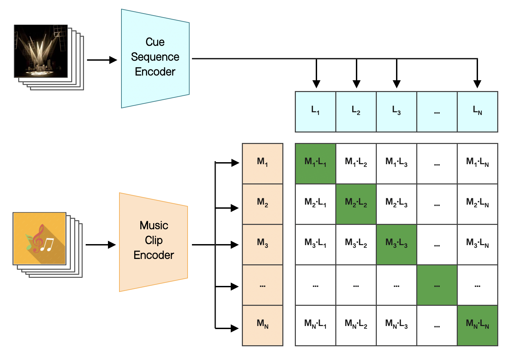

This is the official code for **LightMuse: Novel Framework for Music-driven Stage Light Control**.

With the help of **LAMP (Lighting-Aligned Music Pretraining)**, the first-ever Music and Lighting Feature co-training system, the correlation between Lighting and Music is established.

